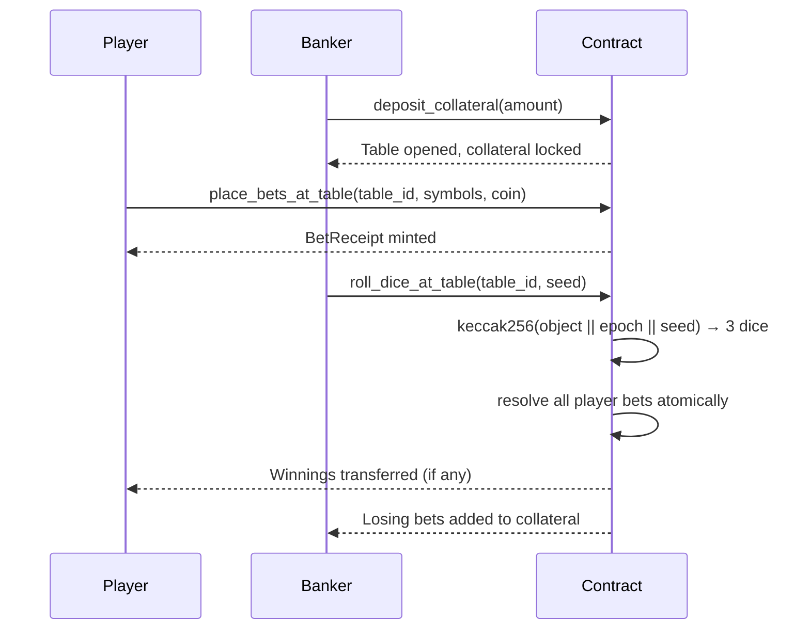
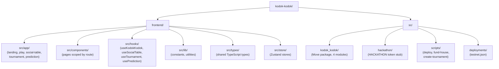

<div align="center">

# 🐸

</div>

# Kodok-Kodok

> *"Di Bangka Belitung, setiap pesta pasti ada Kodok-Kodok."*
> In Bangka Belitung, every celebration has Kodok-Kodok.

**Trustless Crown & Anchor on OneChain** — where anyone can be the banker.

**Live Demo:** [kodok-kodok.vercel.app](https://kodok-kodok.vercel.app) &nbsp;|&nbsp; **Built for OneHack 3.0** — OneChain Testnet

---

## The Story Behind the Game

Kodok-Kodok is a traditional dice game deeply rooted in the culture of Bangka Belitung, Indonesia. Played at weddings, village festivals, and family gatherings for generations, it is as much a social ritual as it is a game of chance.

The original game is simple: six symbols are printed on a cloth — Frog (Kodok), Crab, Fish, Shrimp, Gourd, and Wheel. The banker shakes three dice in a covered bowl. Players bet on which symbols they believe will land face-up. Winners are paid based on how many dice match their symbol.

The problem? You had to trust the banker.

**Kodok-Kodok on OneChain removes that trust requirement entirely.** The smart contract is the banker. Collateral is locked on-chain. Dice are resolved by a verifiable hash. Payouts are automatic. The cultural experience remains — the central point of failure is gone.

---

## Features

### Social Table (PvP) — Core MVP
Anyone can become the banker. Deposit HKT as collateral, open a public table, and let other players join. The banker rolls the dice; the smart contract resolves every bet in one atomic transaction. Losing bets flow to the banker's collateral. Winning bets are paid from it.

- Minimum collateral: 50 HKT
- Up to 4 players per table
- Real-time round history with per-player bet details
- Fully trustless — the banker cannot withdraw collateral while the table is active

### Play (vs House)
Classic solo mode. Pick from the six traditional symbols, stake HKT, and roll three dice. No registration, no waiting — results settle in a single transaction.

### Weekly Tournament
Pay a 10 HKT entry fee, compete across multiple rounds, and climb the live leaderboard. At week's end, the top three players by net P&L split the prize pool: **50 / 30 / 20%**. Two players: 60 / 40. One player: 100%.

### Prediction Market
Bet on meta-outcomes with proportional payouts. 97% of the pool is returned to winners; 3% protocol fee. Anyone can create a market, anyone can resolve it.

---

## Game Flow



---

## Game Mechanics

### How Betting Works (All Game Modes)

All four game modes share the same core dice mechanic: 3 dice are rolled, each showing one of 6 symbols (Frog, Crab, Fish, Shrimp, Gourd, Wheel). Players bet on which symbols will appear. Payouts scale with the number of matching dice:

| Dice Matches | Multiplier | Net Return | Example (10 HKT bet) |
|:---:|:---:|:---:|:---:|
| 0 matches | 0x | −100% | Lose 10 HKT |
| 1 match | 2x | +100% | Win 10 HKT profit |
| 2 matches | 3x | +200% | Win 20 HKT profit |
| 3 matches | 4x | +300% | Win 30 HKT profit |

### House Edge (Play Mode — vs Treasury)

When playing against the house treasury (Play page):

- House edge: **−7.87%** (−17/216 across all 216 possible outcomes)
- Fixed, transparent, and verifiable from the contract source
- Treasury funded with HKT to guarantee all payouts

### Social Table (PvP Mode — vs Banker)

When playing at a Social Table:

- No fixed house edge — the banker takes all losing bets
- Banker's profit or loss depends entirely on the dice outcome
- Collateral locked on-chain guarantees all payouts to winners
- Anyone can become the banker by depositing collateral

### Game Modes Comparison

| Feature | Play (vs House) | Social Table (PvP) | Tournament | Prediction |
|---|---|---|---|---|
| Opponent | Treasury | Another player | Leaderboard | Pool |
| Who rolls? | Smart contract | Banker (player) | Smart contract | N/A |
| Payout source | House treasury | Banker collateral | Prize pool | Prediction pool |
| House edge | 7.87% fixed | 0% (banker risk) | Entry fee | 3% protocol fee |
| Can you be the house? | No | Yes | No | No |

---

## Tech Stack

| Layer | Technology |
|---|---|
| Blockchain | OneChain (Sui-fork L1) |
| Smart Contract | Move 2024 — 4 modules |
| Frontend | Next.js 15 + TypeScript |
| Styling | Tailwind CSS + shadcn/ui |
| Wallet | @onelabs/dapp-kit + OneWallet |
| SDK | @onelabs/sui |
| State Management | Zustand |
| Animations | Framer Motion |
| Notifications | Sonner |
| Deployment | Vercel |

---

## Project Structure



---

## Smart Contract Architecture

Four Move modules deployed as a single package on OneChain Testnet:

```
kodok_kodok::kodok_kodok   — Solo dice game (place_bets → resolve_round)
kodok_kodok::social_table  — PvP tables (banker/player model)
kodok_kodok::tournament    — Weekly leaderboard with prize pool
kodok_kodok::prediction    — Prediction market with pro-rata payouts
```

### Key Functions

| Module | Function | Description |
|---|---|---|
| `kodok_kodok` | `place_bets` | Stake HKT on symbols, mint a BetReceipt |
| `kodok_kodok` | `resolve_round_with_tournament` | Roll dice, settle bets, record P&L |
| `social_table` | `create_table` | Open a public PvP table with collateral |
| `social_table` | `place_bets_at_table` | Player joins and bets against the banker |
| `social_table` | `roll_dice_at_table` | Banker rolls; contract resolves all bets atomically |
| `social_table` | `close_table` | Banker withdraws remaining collateral |
| `tournament` | `join_tournament` | Pay entry fee, enter the weekly competition |
| `tournament` | `finalize_tournament` | Distribute prize pool to top 3 by P&L |
| `prediction` | `place_prediction` | Bet on a market outcome |
| `prediction` | `resolve_market` | Resolve outcome and distribute winnings |

### On-Chain RNG

```
seed = keccak256( fresh_object_address || tx_epoch || caller_provided_seed )
dice[i] = seed_bytes[i] % 6
```

No single party controls the outcome. The caller provides entropy; the chain provides the rest.

---

## Deployed Addresses (OneChain Testnet)

| Object | Address |
|---|---|
| Package | `0x7e9eb9d973c5d0b07544ba298ca17de596fb96b96fc41d44221b7138e36bc082` |
| GameState | `0xae9585354ec13a6565f081e597aabe7ac68f71e6cdd959b4af37f65292fd5388` |
| GameAdmin | `0x2d669d06a43d35d8850e4d4a82b56693f1bb757b73b3fb3691301c04d8b0a490` |
| TableRegistry | `0xee15ba6aedc4f4e2e9074e5af2bb2267eb9e95bdc1f842582427341d2a7a7905` |
| Tournament | `0x060deca0b88f69cd3ccd294689095a630e565ab28950d29cf33444d8fdaad9a6` |
| TournamentAdmin | `0xc30c5d3c546c4fd2c4872c072fc9b5cbd745a3d8dae25934a2ed0e747063a681` |
| PredictionAdmin | `0x3009435e360b3c20079a7afec28a2cbcf609463fdf9c99cb9540207647f02925` |
| HACKATHON Token | `0x8b76fc2a2317d45118770cefed7e57171a08c477ed16283616b15f099391f120::hackathon::HACKATHON` |

**RPC:** `https://rpc-testnet.onelabs.cc:443`

### Transaction Proofs

| Action | TX Digest |
|---|---|
| Contract Deploy | `BU4ikh8iRphnYW759SQzkKWXJgxnBGL8XmjyzS6Fg7cV` |
| Fund House | `7wPDkt2pRZvnFeHT3yYaS41VFnicZuDAeQHTcs8uiqpJ` |
| Create Tournament | `9pfr2yuM7UE6oHEmovKvEkMiLnQMZRrL5QP1sH1eA8ru` |

---

## Run Locally

### Prerequisites

- Node.js 18+
- pnpm
- OneWallet browser extension
- Sui CLI (for smart contract development)

### Frontend

```bash
cd frontend
pnpm install
cp .env.example .env.local
# Fill in your environment variables
pnpm dev
```

### Smart Contracts

```bash
cd sc/kodok_kodok
sui move build
sui move test
```

All **38 Move unit tests** pass across all four modules.

### Deploy (from scratch)

```bash
cd sc

# 1. Deploy the package and all shared objects
DEPLOYER_PRIVATE_KEY=suiprivkey1... pnpm run merge-and-deploy

# 2. Fund the house balance so solo play works
DEPLOYER_PRIVATE_KEY=suiprivkey1... pnpm run fund-house

# 3. Create the first weekly tournament
DEPLOYER_PRIVATE_KEY=suiprivkey1... pnpm run create-tournament
```

Update `frontend/.env.local` with the printed object IDs after each step.

---

## Why Trustless Matters

The original Kodok-Kodok has one structural flaw: you have to trust the banker.

Trust them not to flee with the pot. Trust the dice were not rigged. Trust that when you win, you actually get paid.

On-chain Kodok-Kodok eliminates every one of those trust assumptions:

- **Collateral is locked** — the banker cannot withdraw while the table is active
- **Dice are deterministic** — the outcome is a hash; it cannot be manipulated after bets are placed
- **Payouts are atomic** — winners receive funds in the same transaction that rolls the dice
- **Code is open** — anyone can read the contract and verify the math

The cultural experience of Kodok-Kodok remains. The central point of failure is removed.

---

## Team

| Name | Role |
|---|---|
| Alven Tendrawan | Full Stack Engineer — smart contracts, frontend, deployment |
| Jessica | Editor — content, documentation, UX review |

---

## License

MIT

---

*Built with pride for OneHack 3.0 — bringing the warmth of Bangka Belitung to the blockchain, one roll at a time.*
